# Architecture Documentation - EMURGO Backend Engineer Challenge

## Table of Contents

1. [Architectural Overview](#architectural-overview)
2. [Layer Architecture](#layer-architecture)
3. [Component Design](#component-design)
4. [Database Schema](#database-schema)
5. [Security Architecture](#security-architecture)
6. [Error Handling Architecture](#error-handling-architecture)
7. [Validation Architecture](#validation-architecture)
8. [Deployment Architecture](#deployment-architecture)

## Architectural Overview

The application follows a **Layered Architecture** pattern with clear separation of concerns, implementing the **Repository Pattern** for data access and **Dependency Injection** for loose coupling. The architecture is designed to be maintainable, testable, and scalable.

### Core Architectural Principles

1. **Separation of Concerns**: Each layer has a specific responsibility
2. **Dependency Inversion**: High-level modules don't depend on low-level modules
3. **Single Responsibility**: Each class/module has one reason to change
4. **Open/Closed Principle**: Open for extension, closed for modification
5. **Interface Segregation**: Clients depend only on methods they use

## Layer Architecture

### Layered Architecture Diagram

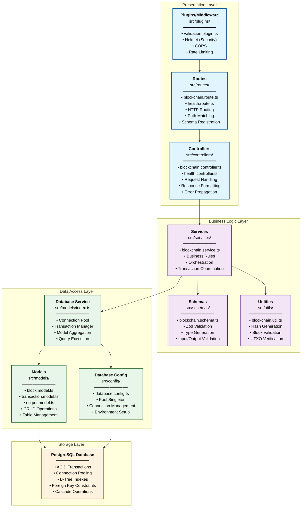

### Request Flow Through Layers

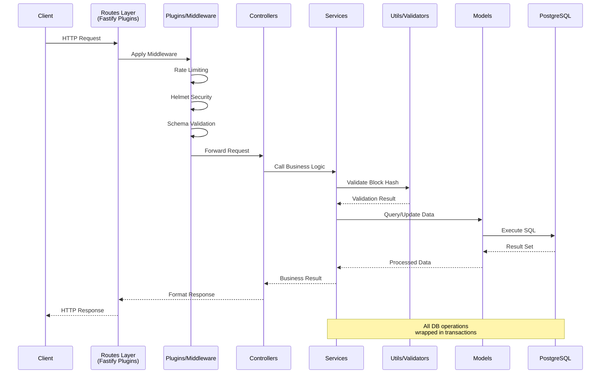

### Component Dependency Graph

```mermaid
graph LR
    subgraph "Entry Point"
        Index["index.ts<br/>(Server Start)"]
        App["app.ts<br/>(App Factory)"]
    end

    subgraph "Configuration"
        AppConfig["app.config.ts"]
        DBConfig["database.config.ts"]
    end

    subgraph "Routes"
        RouteIndex["routes/index.ts"]
        BlockchainRoute["blockchain.route.ts"]
        HealthRoute["health.route.ts"]
    end

    subgraph "Controllers"
        BlockchainCtrl["blockchain.controller.ts"]
        HealthCtrl["health.controller.ts"]
    end

    subgraph "Services"
        BlockchainSvc["blockchain.service.ts"]
    end

    subgraph "Models"
        ModelIndex["models/index.ts<br/>(DatabaseService)"]
        BlockModel["block.model.ts"]
        TxModel["transaction.model.ts"]
        OutputModel["output.model.ts"]
    end

    Index --> App
    App --> AppConfig
    App --> DBConfig
    App --> RouteIndex
    RouteIndex --> BlockchainRoute
    RouteIndex --> HealthRoute
    BlockchainRoute --> BlockchainCtrl
    HealthRoute --> HealthCtrl
    BlockchainCtrl --> BlockchainSvc
    HealthCtrl --> ModelIndex
    BlockchainSvc --> ModelIndex
    ModelIndex --> BlockModel
    ModelIndex --> TxModel
    ModelIndex --> OutputModel

    style Index fill:#FFE0B2,stroke:#E65100,stroke-width:3px,color:black
    style App fill:#FFE0B2,stroke:#E65100,stroke-width:3px,color:black
    style AppConfig fill:#E1F5FE,stroke:#01579B,stroke-width:2px,color:black
    style DBConfig fill:#E1F5FE,stroke:#01579B,stroke-width:2px,color:black
    style RouteIndex fill:#E8F5E9,stroke:#1B5E20,stroke-width:2px,color:black
    style BlockchainRoute fill:#E8F5E9,stroke:#1B5E20,stroke-width:2px,color:black
    style HealthRoute fill:#E8F5E9,stroke:#1B5E20,stroke-width:2px,color:black
    style BlockchainCtrl fill:#F3E5F5,stroke:#4A148C,stroke-width:2px,color:black
    style HealthCtrl fill:#F3E5F5,stroke:#4A148C,stroke-width:2px,color:black
    style BlockchainSvc fill:#FFF9C4,stroke:#F57F17,stroke-width:2px,color:black
    style ModelIndex fill:#FFEBEE,stroke:#B71C1C,stroke-width:2px,color:black
    style BlockModel fill:#FFEBEE,stroke:#B71C1C,stroke-width:2px,color:black
    style TxModel fill:#FFEBEE,stroke:#B71C1C,stroke-width:2px,color:black
    style OutputModel fill:#FFEBEE,stroke:#B71C1C,stroke-width:2px,color:black
```

## Component Design

### 1. Presentation Layer Components

#### Routes (src/routes/)

```typescript
// Fastify Route Definition Pattern
export default async function blockchainRoutes(fastify: FastifyInstance, options: any) {
  const controller = new BlockchainController(fastify.db.service);

  fastify.post(
    '/blocks',
    {
      schema: { body: BlockSchema }
    },
    controller.processBlock.bind(controller)
  );

  fastify.get('/balance/:address', controller.getBalance.bind(controller));
  fastify.post('/rollback', controller.rollback.bind(controller));
}
```

**Design Rationale:**

- Fastify plugin-based architecture for modularity
- Built-in schema validation with Zod integration
- Type-safe request/response handling
- Automatic OpenAPI documentation generation (future)

#### Controllers (src/controllers/)

```typescript
// Fastify Controller Pattern
export class BlockchainController {
  constructor(private blockchainService: BlockchainService) {}

  async processBlock(request: FastifyRequest<{ Body: Block }>, reply: FastifyReply) {
    try {
      const result = await this.blockchainService.processBlock(request.body);
      return reply.status(200).send(result);
    } catch (error) {
      // Fastify handles error propagation automatically
      throw error;
    }
  }
}
```

**Design Rationale:**

- Thin controllers focus only on HTTP concerns
- Fastify automatically handles error serialization
- Business logic is delegated to services
- Type-safe request/reply objects with generics

### 2. Business Logic Layer Components

#### Services (src/services/)

```typescript
// Service Layer Pattern
export class BlockchainService {
  constructor(private dbService: DatabaseService) {}

  async processBlock(block: Block): Promise<ProcessResult> {
    // 1. Validation
    const validation = await this.validateBlock(block);
    if (!validation.valid) throw new ValidationError(validation.error);

    // 2. Transaction Management
    return await this.dbService.executeTransaction(async tx => {
      await this.insertBlock(block, tx);
      await this.updateBalances(block, tx);
      return { blockId: block.id, height: block.height };
    });
  }
}
```

**Design Rationale:**

- Encapsulates business rules and workflows
- Manages transaction boundaries
- Coordinates between multiple data operations

#### Validation (src/utils.ts)

```typescript
// Validation Strategy Pattern
export function validateBlock(
  block: Block,
  currentHeight: number,
  inputValidation: InputValidationResult
): ValidationError | null {
  // Height validation
  if (block.height !== currentHeight + 1) {
    return { code: 'INVALID_HEIGHT', message: '...' };
  }

  // Hash validation
  if (!validateBlockHash(block)) {
    return { code: 'INVALID_BLOCK_ID', message: '...' };
  }

  // Input/Output validation
  if (!validateInputOutputBalance(block, inputValidation)) {
    return { code: 'INVALID_BALANCE', message: '...' };
  }

  return null;
}
```

**Design Rationale:**

- Pure functions for easy testing
- Specific error codes for different validation failures
- Composable validation rules

### 3. Data Access Layer Components

#### DatabaseService (src/models/index.ts)

```typescript
// Service Facade Pattern
export class DatabaseService {
  constructor(private pool: Pool) {
    this.blockModel = new BlockModel(pool);
    this.transactionModel = new TransactionModel(pool);
    this.outputModel = new OutputModel(pool);
  }

  async executeTransaction<T>(operation: (client: PoolClient) => Promise<T>): Promise<T> {
    const client = await this.pool.connect();
    try {
      await client.query('BEGIN');
      const result = await operation(client);
      await client.query('COMMIT');
      return result;
    } catch (error) {
      await client.query('ROLLBACK');
      throw error;
    } finally {
      client.release();
    }
  }
}
```

**Design Rationale:**

- Provides unified interface to data layer
- Manages database transactions centrally
- Abstracts connection pooling complexity

#### Model Classes (src/models/)

```typescript
// Active Record Pattern
export class BlockModel {
  constructor(private pool: Pool) {}

  async insert(block: Block): Promise<void> {
    await this.pool.query('INSERT INTO blocks (id, height) VALUES ($1, $2)', [
      block.id,
      block.height
    ]);
  }

  async getCurrentHeight(): Promise<number> {
    const result = await this.pool.query('SELECT COALESCE(MAX(height), 0) as height FROM blocks');
    return result.rows[0].height;
  }
}
```

**Design Rationale:**

- Each model manages one database table
- Encapsulates SQL queries and database operations
- Provides type-safe interfaces

## Database Schema

### Entity Relationship Diagram

See database [Entity-Relationship Diagram](./diagrams/database-erd.md)

### Schema Design Principles

1. **Normalization**: Tables are in 3NF to eliminate redundancy
2. **Referential Integrity**: Foreign key constraints ensure data consistency
3. **Indexing Strategy**: Indexes on frequently queried columns
4. **Audit Trail**: Created_at timestamps for temporal queries

### Key Design Decisions

#### 1. Separate Balance Table

- **Rationale**: Real-time balance calculation from outputs would be expensive
- **Trade-off**: Storage space vs. query performance
- **Implementation**: Trigger-based balance updates ensure consistency

#### 2. is_spent Flag

- **Rationale**: Enables efficient UTXO tracking without complex joins
- **Alternative**: Could use LEFT JOIN to check if output is referenced as input
- **Benefit**: O(1) lookup for spend status vs. O(log n) join operation

#### 3. Composite Indexes

```sql
-- Optimized for balance queries
CREATE INDEX idx_outputs_address_unspent ON outputs (address, is_spent) WHERE is_spent = false;

-- Optimized for input validation
CREATE INDEX idx_outputs_tx_index ON outputs (transaction_id, output_index);
```

## Security Architecture

### Security Layers Diagram

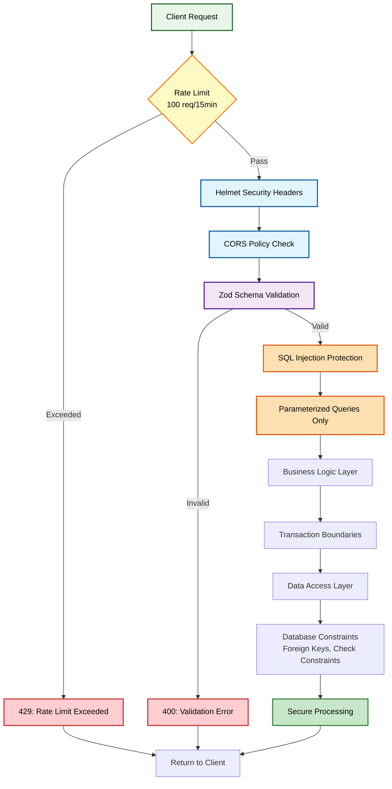

### Defense in Depth Strategy

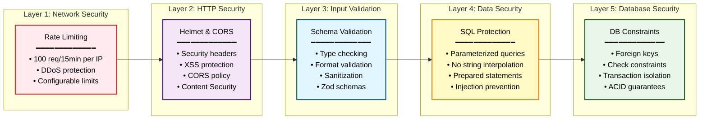

### 1. Input Validation

```typescript
// Multi-layer validation with Fastify
await app.register(import('@fastify/helmet'), { global: true });
await app.register(import('@fastify/cors'), { origin: true });
await app.register(import('@fastify/rate-limit'), {
  max: 100,
  timeWindow: '15 minutes'
});

// Schema validation via Fastify plugin
await app.register(import('./plugins/validation.plugin'));

// Route-level schema validation
fastify.post(
  '/blocks',
  {
    schema: { body: BlockSchema }
  },
  handler
);
```

### 2. SQL Injection Prevention

```typescript
// Parameterized queries only
await this.pool.query('SELECT * FROM outputs WHERE address = $1 AND is_spent = $2', [
  address,
  false
]);
```

### 3. Error Information Disclosure

```typescript
// Generic error responses to external clients
if (process.env.NODE_ENV === 'production') {
  return res.status(500).json({ error: 'Internal Server Error' });
} else {
  return res.status(500).json({ error: error.message, stack: error.stack });
}
```

## Error Handling Architecture

### Error Flow Diagram

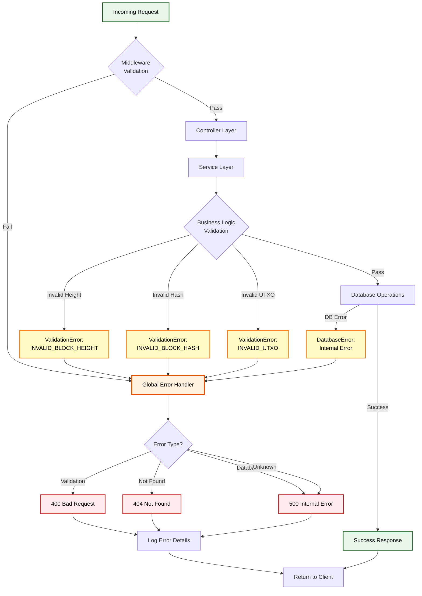

### Error Hierarchy

```typescript
// Base error classes
class ApiError extends Error {
  constructor(
    message: string,
    public statusCode: number,
    public code: string
  ) {
    super(message);
  }
}

class ValidationError extends ApiError {
  constructor(message: string) {
    super(message, 400, 'VALIDATION_ERROR');
  }
}

class BusinessLogicError extends ApiError {
  constructor(message: string, code: string) {
    super(message, 400, code);
  }
}
```

### Centralized Error Handling

```typescript
// Fastify error handler
app.setErrorHandler(async (error, request, reply) => {
  const statusCode = error.statusCode || 500;
  const errorCode = (error as any).code || 'INTERNAL_ERROR';
  const message = error.message || 'Internal server error';

  request.log.error({ error, statusCode, errorCode }, `Error ${statusCode}: ${message}`);

  return reply.status(statusCode).send({
    error: errorCode,
    message
  });
});

// 404 handler
app.setNotFoundHandler(async (request, reply) => {
  return reply.status(404).send({
    error: 'NOT_FOUND',
    message: 'Endpoint not found'
  });
});
```

### Error Types and Status Codes

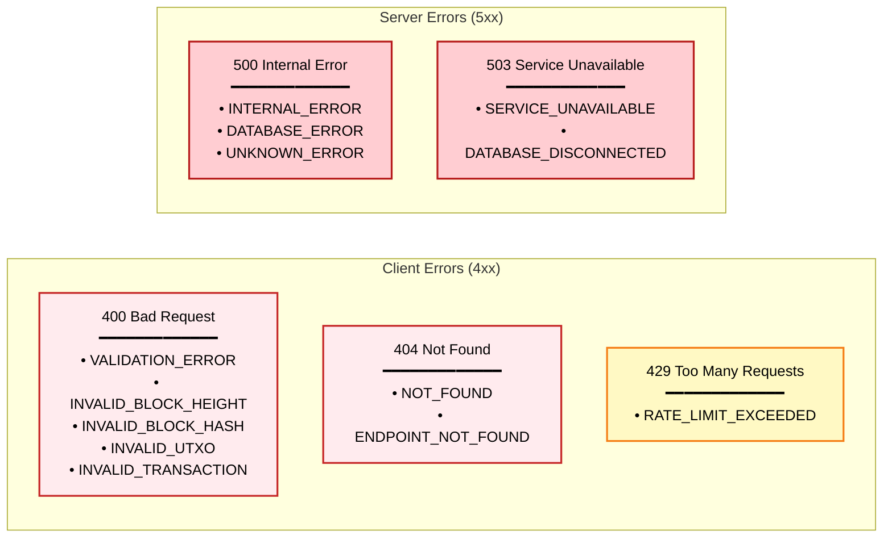

## Validation Architecture

### Validation Flow Diagram

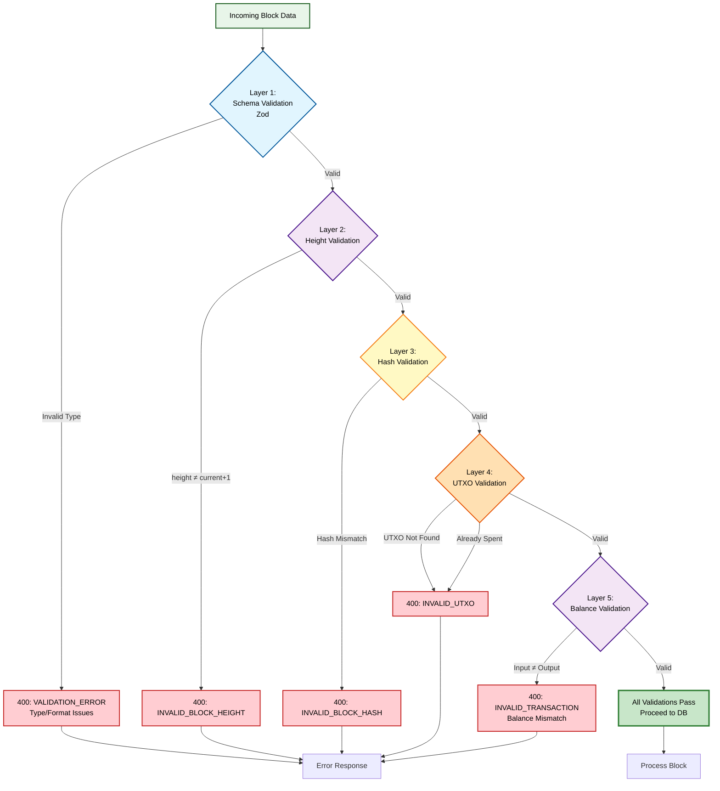

### Schema-First Design

```typescript
// Zod schemas define both runtime validation and TypeScript types
export const BlockSchema = z.object({
  id: z.string().min(1),
  height: z.number().int().positive(),
  transactions: z.array(TransactionSchema)
});

export type Block = z.infer<typeof BlockSchema>;
```

### Validation Layers

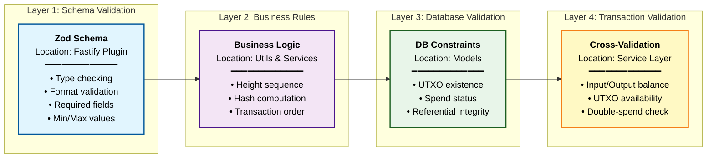

### Validation Implementation Details

| Layer          | Component                    | Validation Type                      | Error Code             |
| -------------- | ---------------------------- | ------------------------------------ | ---------------------- |
| **1. Schema**  | `validation.plugin.ts` + Zod | Type, Format, Required fields        | `VALIDATION_ERROR`     |
| **2. Height**  | `blockchain.util.ts`         | `height === currentHeight + 1`       | `INVALID_BLOCK_HEIGHT` |
| **3. Hash**    | `blockchain.util.ts`         | `sha256(height + txIds) === blockId` | `INVALID_BLOCK_HASH`   |
| **4. UTXO**    | `output.model.ts`            | Check existence & spend status       | `INVALID_UTXO`         |
| **5. Balance** | `blockchain.util.ts`         | `sum(inputs) === sum(outputs)`       | `INVALID_TRANSACTION`  |

## Deployment Architecture

### Docker Deployment Diagram

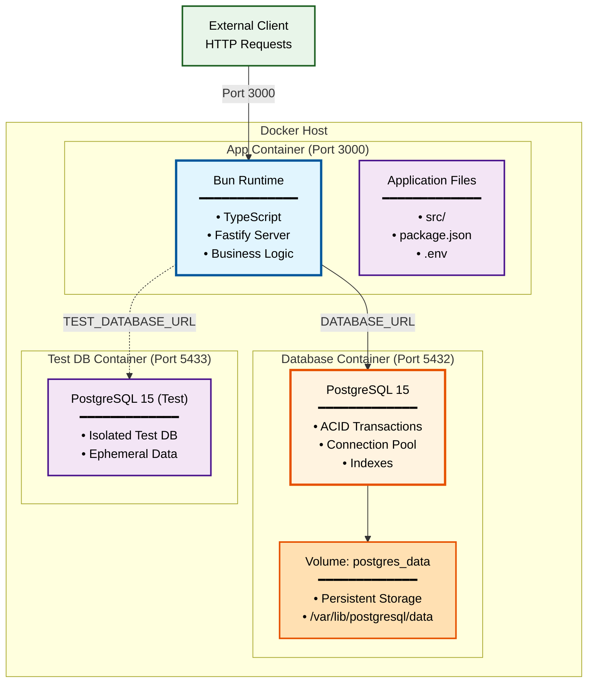

### Container Orchestration Flow

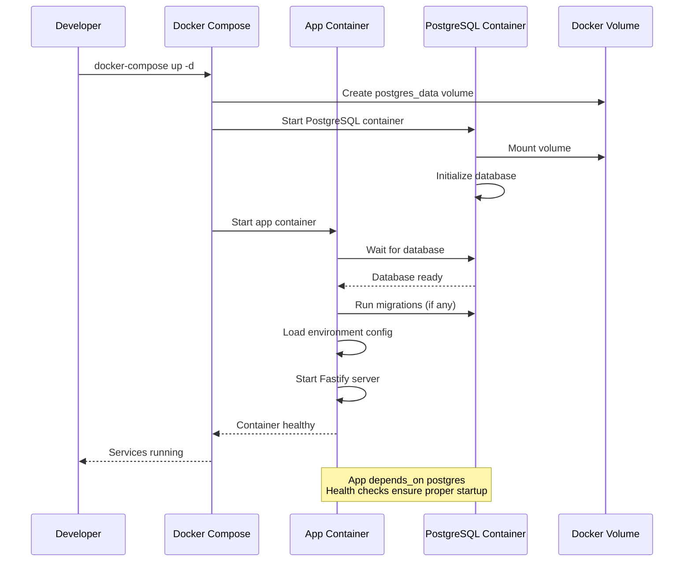

### Docker Container Strategy

```dockerfile
# Multi-stage build for optimization
FROM oven/bun:1 AS builder
WORKDIR /app
COPY package.json bun.lockb ./
RUN bun install --production

FROM oven/bun:1 AS runtime
WORKDIR /app
COPY --from=builder /app/node_modules ./node_modules
COPY . .
EXPOSE 3000
CMD ["bun", "src/index.ts"]
```

### Container Orchestration

```yaml
# docker-compose.yml
services:
  app:
    build: .
    ports:
      - '3000:3000'
    environment:
      - DATABASE_URL=postgres://myuser:mypassword@db:5432/mydatabase
      - NODE_ENV=production
    depends_on:
      db:
        condition: service_healthy
    restart: unless-stopped

  db:
    image: postgres:15-alpine
    environment:
      - POSTGRES_DB=mydatabase
      - POSTGRES_USER=myuser
      - POSTGRES_PASSWORD=mypassword
    volumes:
      - postgres_data:/var/lib/postgresql/data
    ports:
      - '5432:5432'
    healthcheck:
      test: ['CMD-SHELL', 'pg_isready -U myuser -d mydatabase']
      interval: 10s
      timeout: 5s
      retries: 5
    restart: unless-stopped

volumes:
  postgres_data:
```

### Environment Configuration

```typescript
// Configuration management
export const AppConfig = {
  PORT: process.env.PORT || 3000,
  DATABASE_URL: process.env.DATABASE_URL || 'postgres://localhost/mydatabase',
  NODE_ENV: process.env.NODE_ENV || 'development',
  MAX_ROLLBACK_BLOCKS: Number(process.env.MAX_ROLLBACK_BLOCKS) || 2000
};
```

## Architecture Benefits

### 1. Maintainability

- Clear separation of concerns
- Modular design enables independent changes
- Comprehensive test coverage possible at each layer

### 2. Scalability

- Stateless application design
- Database connection pooling
- Horizontal scaling capabilities

### 3. Reliability

- ACID transaction guarantees
- Comprehensive error handling
- Input validation at multiple layers

### 4. Security

- Defense in depth approach
- Input sanitization and validation
- Secure defaults and best practices

### 5. Testability

- Dependency injection enables easy mocking
- Pure functions for validation logic
- Each layer can be tested independently

This architecture provides a solid foundation for the blockchain indexer while maintaining flexibility for future enhancements and requirements.
