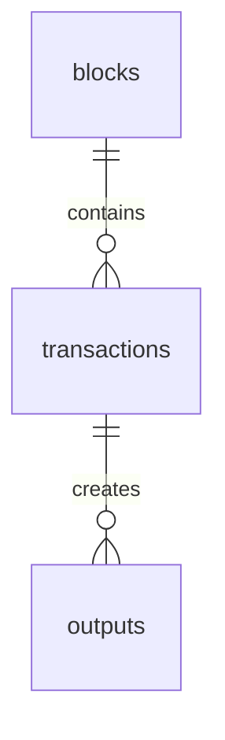
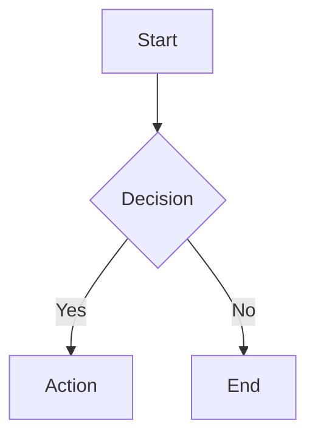
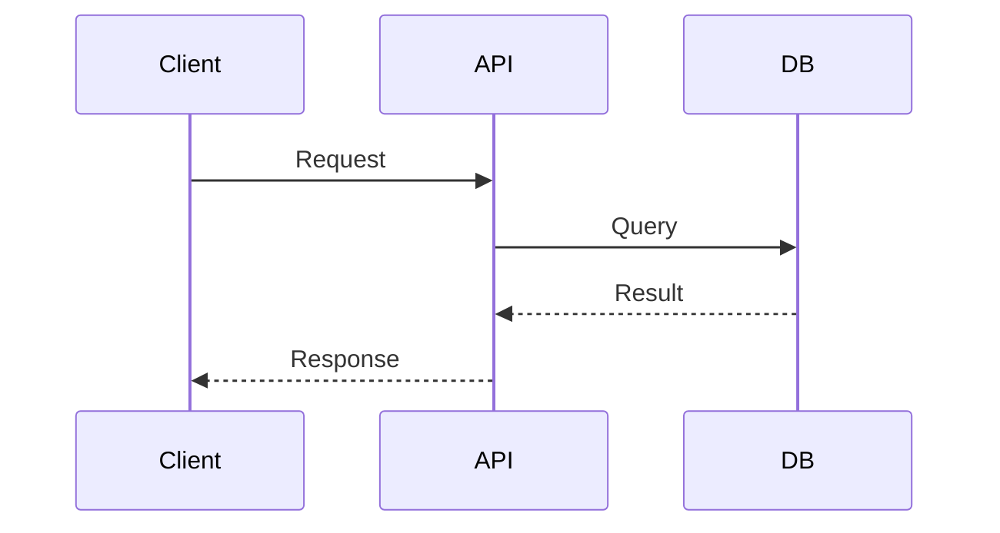
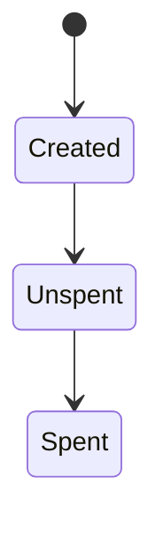

# Documentation Diagrams

Professional diagrams and flowcharts for the blockchain indexer system.

## 📋 Available Diagrams

### 1. [Database ERD](./database-erd.md)

**Entity Relationship Diagram** showing the complete database schema, relationships, and UTXO model.

**Includes:**

- Visual Mermaid ERD
- Table relationships and foreign keys
- UTXO model explanation
- Index and performance optimization
- Data integrity rules
- Storage estimates

**Best for:** Understanding database structure, relationships, and how UTXO model works.

---

### 2. [UTXO Flow Examples](./utxo-flow-examples.md)

**Transaction flow diagrams** showing how UTXOs are created, spent, and tracked through the system.

**Includes:**

- Genesis block creation (coinbase)
- Regular transactions with inputs/outputs
- Multiple inputs/outputs handling
- Change transactions
- Complete block processing flow
- UTXO state machine

**Best for:** Understanding transaction processing, UTXO lifecycle, and balance calculations.

---

### 3. [API Endpoints Flowcharts](./api-endpoints-flowcharts.md)

**Complete flowcharts** for all API endpoints with request/response examples.

**Includes:**

- `POST /api/blocks` - Process block flow
- `GET /api/balance/:address` - Get balance flow
- `POST /api/rollback` - Rollback blockchain flow
- `GET /health` - Health check flow
- Error handling flows
- Rate limiting

**Best for:** Understanding API behavior, validation steps, and error handling.

---

### 4. [Test Cases with Examples](./test-cases-examples.md)

**Comprehensive test case diagrams** with real example data.

**Includes:**

- Happy path test suite (3 tests)
- Error handling test suite (4 tests)
- Edge cases test suite (3 tests)
- Performance test suite (2 tests)
- Rollback test suite (2 tests)

**Best for:** QA testing, validation scenarios, and understanding expected behavior.

---

## 🎨 Diagram Types Used

All diagrams use **Mermaid.js** syntax for rendering in GitHub, GitLab, and documentation tools.

### Entity Relationship Diagrams (ERD)



### Flowcharts



### Sequence Diagrams



### State Diagrams



---

## 🚀 How to View Diagrams

### Option 1: GitHub/GitLab

Open any `.md` file in this directory on GitHub or GitLab - Mermaid diagrams render automatically.

### Option 2: VS Code

Install the **Markdown Preview Mermaid Support** extension:

```bash
code --install-extension bierner.markdown-mermaid
```

Then press `Cmd+Shift+V` (Mac) or `Ctrl+Shift+V` (Windows/Linux) to preview.

### Option 3: Online Viewer

Copy Mermaid code and paste into: https://mermaid.live/

### Option 4: Documentation Site

Use tools like:

- **Docusaurus** - Built-in Mermaid support
- **MkDocs** - With mermaid2 plugin
- **GitBook** - Native Mermaid support

---

## 📖 Quick Navigation

| Need to understand... | Go to...                                                  |
| --------------------- | --------------------------------------------------------- |
| Database structure    | [Database ERD](./database-erd.md)                         |
| How transactions work | [UTXO Flow Examples](./utxo-flow-examples.md)             |
| API endpoint behavior | [API Endpoints Flowcharts](./api-endpoints-flowcharts.md) |
| Testing scenarios     | [Test Cases Examples](./test-cases-examples.md)           |

---

## 🔄 Diagram Updates

These diagrams are kept in sync with:

- Database schema in `migrations/001_initial_schema.sql`
- API routes in `src/routes/`
- Service logic in `src/services/`
- Test cases in `spec/`

**Last Updated:** 2025-10-03

---

## 💡 Usage Examples

### For Developers

1. **Onboarding**: Start with [Database ERD](./database-erd.md) to understand schema
2. **Feature Development**: Check [UTXO Flow Examples](./utxo-flow-examples.md) for transaction logic
3. **API Integration**: Use [API Endpoints Flowcharts](./api-endpoints-flowcharts.md) for request/response formats

### For QA Engineers

1. **Test Planning**: Use [Test Cases Examples](./test-cases-examples.md) for comprehensive scenarios
2. **Validation**: Cross-reference expected behavior in flowcharts
3. **Bug Reporting**: Include relevant diagram sections in bug reports

### For Documentation Writers

1. **Technical Docs**: Embed diagrams in documentation
2. **User Guides**: Use API flowcharts for endpoint documentation
3. **Architecture Docs**: Use ERD for system design documentation

---

## 🛠️ Creating New Diagrams

When adding new features, update or create diagrams following this template:

```markdown
# Feature Name

## Overview

Brief description of what this diagram shows.

## Visual Diagram

\`\`\`mermaid
graph TD
A[Step 1] --> B[Step 2]
\`\`\`

## Example Data

\`\`\`json
{
"example": "data"
}
\`\`\`

## Explanation

Detailed explanation of the flow.
```

---

## 📝 Diagram Conventions

### Colors

- 🟢 **Green**: Success, valid states
- 🔴 **Red**: Errors, invalid states
- 🔵 **Blue**: Database operations
- 🟡 **Yellow**: Processing, transactions

### Symbols

- ✅ Success
- ❌ Failure
- ⚠️ Warning
- 🔄 Process
- 📊 Data

### Naming

- Use `kebab-case` for file names
- Use descriptive titles in headers
- Keep diagram IDs consistent

---

## 🤝 Contributing

To add or update diagrams:

1. Follow existing Mermaid syntax patterns
2. Include example data where applicable
3. Add clear explanations
4. Test rendering in GitHub/VS Code
5. Update this README with new diagram links

---

## 📚 Related Documentation

- [Main Documentation](../../docs/)
- [API Documentation](../../docs/03-api-documentation.md)
- [Implementation Details](../../docs/04-implementation-details.md)
- [Database Schema](../../schema.sql)
- [Migrations](../../migrations/)

---

## 📞 Support

For questions about these diagrams:

1. Check the diagram's explanation section
2. Review related code in `src/`
3. Run corresponding tests in `spec/`
4. Refer to main documentation in `docs/`
