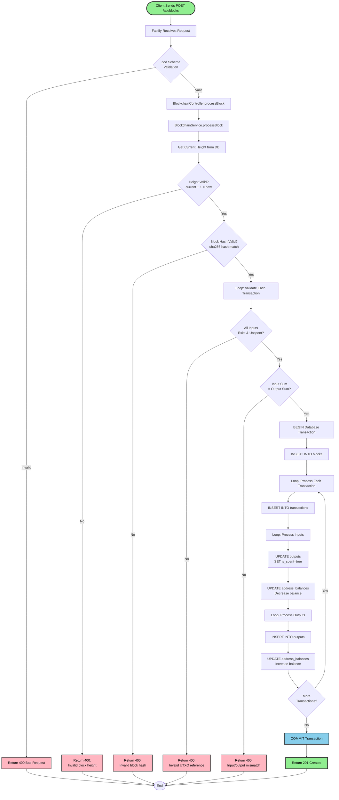
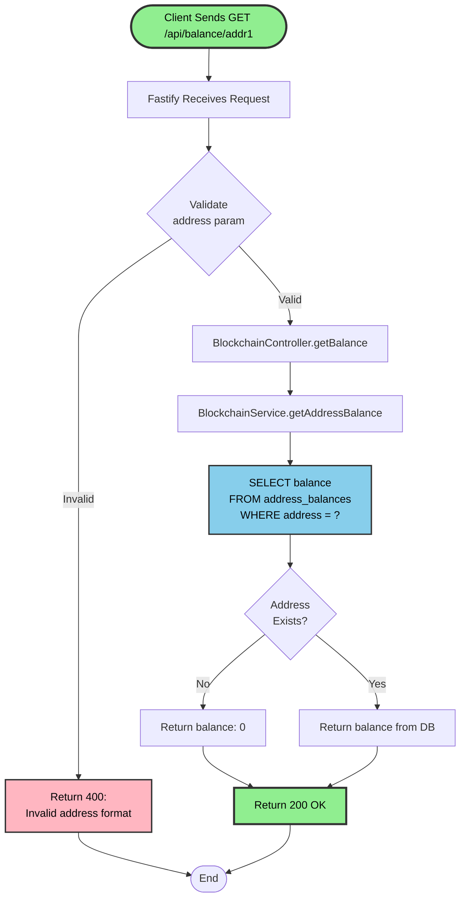
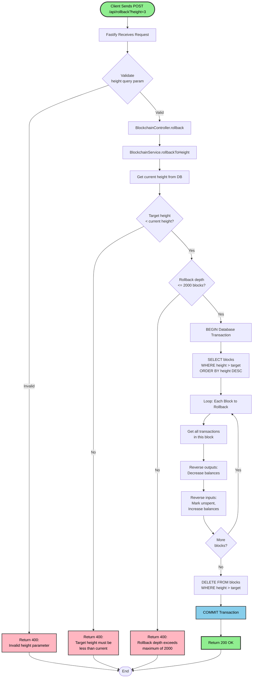
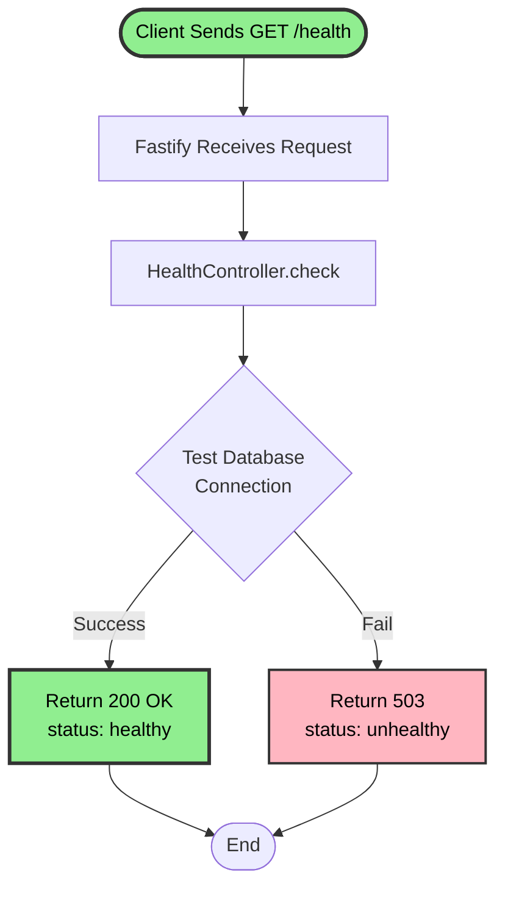
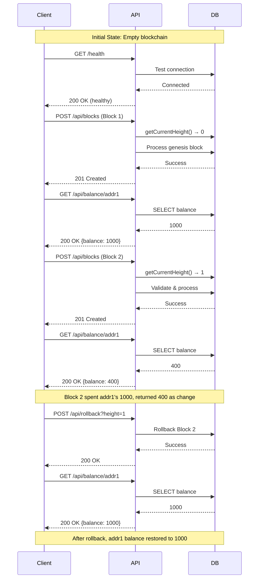
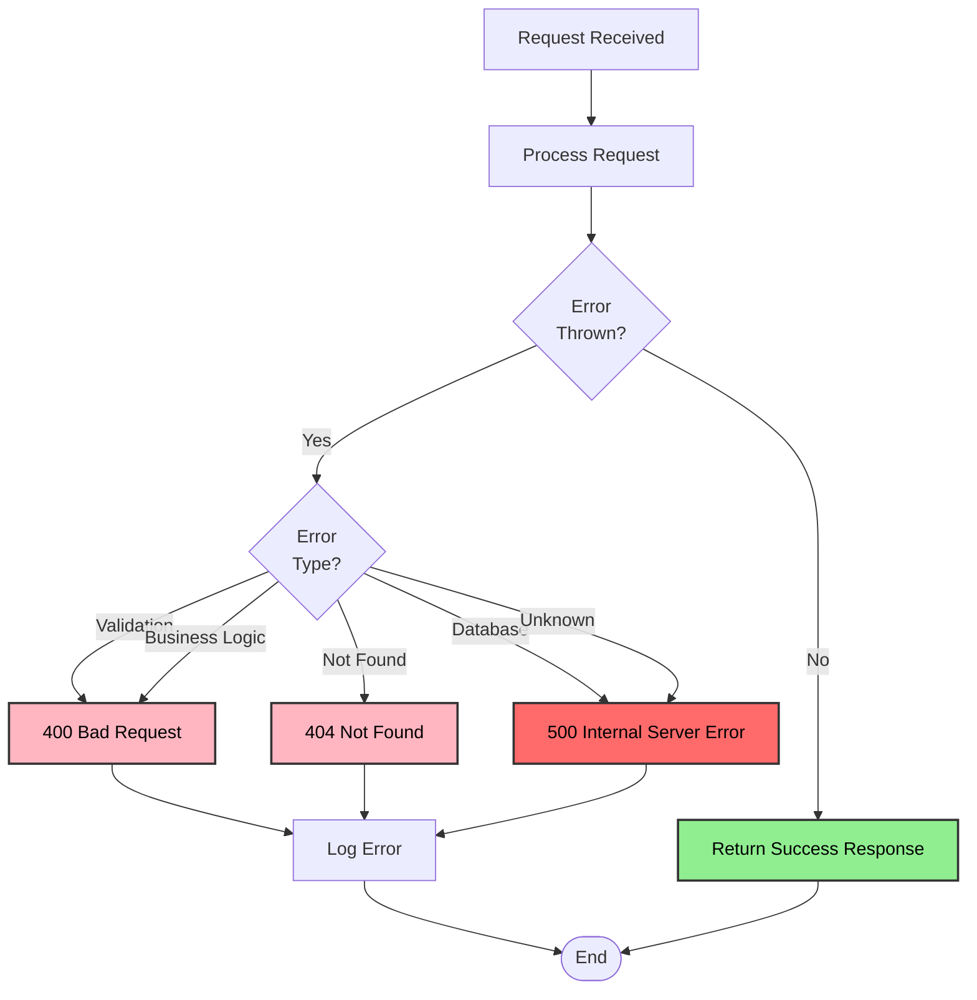

# API Endpoints Flowcharts

Complete end-to-end flowcharts for all API endpoints with example requests, responses, and error cases.

## Table of Contents

1. [POST /api/blocks](#post-apiblocks---process-block)
2. [GET /api/balance/:address](#get-apibalanceaddress---get-balance)
3. [POST /api/rollback](#post-apirollback---rollback-blockchain)
4. [GET /health](#get-health---health-check)

---

## POST /api/blocks - Process Block

### Endpoint Overview

**Purpose**: Submit and process a new block with transactions
**Method**: `POST`
**URL**: `/api/blocks`
**Authentication**: None (public endpoint)

### Complete Flow Diagram



### Request Example

```bash
curl -X POST http://localhost:3000/api/blocks \
  -H "Content-Type: application/json" \
  -d '{
    "id": "5f4dcc3b5aa765d61d8327deb882cf99",
    "height": 2,
    "transactions": [
      {
        "id": "tx3",
        "inputs": [
          { "txId": "tx1", "index": 0 }
        ],
        "outputs": [
          { "address": "addr6", "value": 600 },
          { "address": "addr1", "value": 400 }
        ]
      }
    ]
  }'
```

### Success Response (201 Created)

```json
{
  "message": "Block processed successfully",
  "height": 2,
  "blockId": "5f4dcc3b5aa765d61d8327deb882cf99"
}
```

### Error Responses

#### 400 - Schema Validation Failed

```json
{
  "error": "VALIDATION_ERROR",
  "message": "Invalid request body",
  "details": [
    {
      "path": ["transactions", 0, "outputs", 0, "value"],
      "message": "Expected number, received string"
    }
  ]
}
```

#### 400 - Invalid Height

```json
{
  "error": "INVALID_BLOCK_HEIGHT",
  "message": "Block height must be 2, but received 3",
  "currentHeight": 1
}
```

#### 400 - Invalid Hash

```json
{
  "error": "INVALID_BLOCK_HASH",
  "message": "Block hash does not match computed hash"
}
```

#### 400 - Invalid UTXO

```json
{
  "error": "INVALID_UTXO",
  "message": "Referenced output tx1[0] does not exist or is already spent"
}
```

#### 400 - Balance Mismatch

```json
{
  "error": "INVALID_TRANSACTION",
  "message": "Transaction tx3: input sum (1000) does not equal output sum (900)"
}
```

### Database Changes

**Before:**

```sql
-- Current height: 1
-- addr1 balance: 1000
```

**After Success:**

```sql
-- blocks table
INSERT INTO blocks (id, height) VALUES ('5f4dcc3b...', 2);

-- transactions table
INSERT INTO transactions (id, block_id, block_height)
VALUES ('tx3', '5f4dcc3b...', 2);

-- outputs table (mark spent)
UPDATE outputs SET is_spent=true, spent_in_transaction_id='tx3'
WHERE transaction_id='tx1' AND output_index=0;

-- outputs table (create new)
INSERT INTO outputs (transaction_id, output_index, address, value, block_height)
VALUES ('tx3', 0, 'addr6', 600, 2),
       ('tx3', 1, 'addr1', 400, 2);

-- address_balances table
UPDATE address_balances SET balance=0 WHERE address='addr1';    -- spent 1000
UPDATE address_balances SET balance=1000 WHERE address='addr6'; -- new 600
UPDATE address_balances SET balance=400 WHERE address='addr1';  -- change 400
```

---

## GET /api/balance/:address - Get Balance

### Endpoint Overview

**Purpose**: Retrieve current balance for an address
**Method**: `GET`
**URL**: `/api/balance/:address`
**Authentication**: None

### Complete Flow Diagram



### Request Example

```bash
curl -X GET http://localhost:3000/api/balance/addr1
```

### Success Response (200 OK)

```json
{
  "address": "addr1",
  "balance": 400
}
```

### Response for Non-Existent Address

```json
{
  "address": "addr999",
  "balance": 0
}
```

### Error Response (400 - Invalid Address)

```json
{
  "error": "VALIDATION_ERROR",
  "message": "Address parameter is required and must be a string"
}
```

### Database Query

```sql
SELECT balance
FROM address_balances
WHERE address = 'addr1';

-- Result: { balance: 400 }
```

### Performance Notes

- **Query Complexity**: O(1) - Primary key lookup
- **Index Used**: `address_balances.address` (PRIMARY KEY)
- **Average Response Time**: < 5ms

---

## POST /api/rollback - Rollback Blockchain

### Endpoint Overview

**Purpose**: Rollback blockchain to a specific height
**Method**: `POST`
**URL**: `/api/rollback?height=N`
**Authentication**: None
**Limit**: Maximum 2000 blocks rollback

### Complete Flow Diagram



### Request Example

```bash
curl -X POST "http://localhost:3000/api/rollback?height=3"
```

### Success Response (200 OK)

```json
{
  "message": "Blockchain rolled back successfully",
  "newHeight": 3,
  "blocksRemoved": 3
}
```

### Error Responses

#### 400 - Invalid Height Parameter

```json
{
  "error": "VALIDATION_ERROR",
  "message": "Height must be a valid integer"
}
```

#### 400 - Target Height Too High

```json
{
  "error": "INVALID_ROLLBACK_HEIGHT",
  "message": "Target height (7) must be less than current height (6)"
}
```

#### 400 - Rollback Depth Exceeded

```json
{
  "error": "ROLLBACK_DEPTH_EXCEEDED",
  "message": "Cannot rollback more than 2000 blocks. Requested: 2500"
}
```

### Rollback Process Example

**Scenario**: Rollback from height 6 to height 3

#### Before Rollback

```
Blocks: 1, 2, 3, 4, 5, 6
Current height: 6
```

#### After Rollback

```
Blocks: 1, 2, 3
Current height: 3
```

### Database Changes

```sql
-- For each block (6, 5, 4 in reverse order):

-- 1. Get all transactions in block
SELECT id FROM transactions WHERE block_id = ?;

-- 2. Reverse outputs (created by this block)
SELECT address, value FROM outputs WHERE transaction_id IN (?);
UPDATE address_balances
SET balance = balance - value, last_updated_height = 3
WHERE address = ?;

-- 3. Reverse inputs (spent by this block)
SELECT address, value FROM outputs WHERE spent_in_transaction_id IN (?);
UPDATE outputs
SET is_spent = false, spent_in_transaction_id = NULL
WHERE spent_in_transaction_id IN (?);

UPDATE address_balances
SET balance = balance + value, last_updated_height = 3
WHERE address = ?;

-- 4. Delete all blocks > target height
DELETE FROM blocks WHERE height > 3;
-- CASCADE automatically deletes transactions and outputs
```

### Balance Changes Example

**Before Rollback (Height 6):**

```
addr30: 426
addr31: 284
addr32: 81
```

**After Rollback to Height 3:**

```
addr30: 0    (outputs deleted)
addr31: 0    (outputs deleted)
addr32: 0    (outputs deleted)

-- Previously spent outputs become unspent again
addr13: 440  (was 0, now restored)
addr14: 270  (was 0, now restored)
addr15: 270  (was 0, now restored)
```

---

## GET /health - Health Check

### Endpoint Overview

**Purpose**: Check if service is running and database is connected
**Method**: `GET`
**URL**: `/health`
**Authentication**: None

### Complete Flow Diagram



### Request Example

```bash
curl -X GET http://localhost:3000/health
```

### Success Response (200 OK)

```json
{
  "status": "healthy",
  "timestamp": "2025-10-03T10:30:00.000Z",
  "database": "connected"
}
```

### Error Response (503 Service Unavailable)

```json
{
  "status": "unhealthy",
  "timestamp": "2025-10-03T10:30:00.000Z",
  "database": "disconnected",
  "error": "Connection to database failed"
}
```

---

## API Call Sequence Example

### Scenario: Complete Blockchain Build



---

## Error Handling Flow

### Global Error Handler



### Common Error Codes

| Status Code | Error Type          | Example                                        |
| ----------- | ------------------- | ---------------------------------------------- |
| 400         | Bad Request         | Invalid schema, invalid height, UTXO not found |
| 404         | Not Found           | Endpoint does not exist                        |
| 500         | Internal Error      | Database connection failed, unexpected error   |
| 503         | Service Unavailable | Health check failed                            |

---

## Rate Limiting

All endpoints are rate-limited (configurable via environment variables):

```
Default: 100 requests per 15 minutes per IP
```

### Rate Limit Exceeded Response (429)

```json
{
  "error": "RATE_LIMIT_EXCEEDED",
  "message": "Too many requests from this IP, please try again later",
  "expiresIn": 300
}
```
