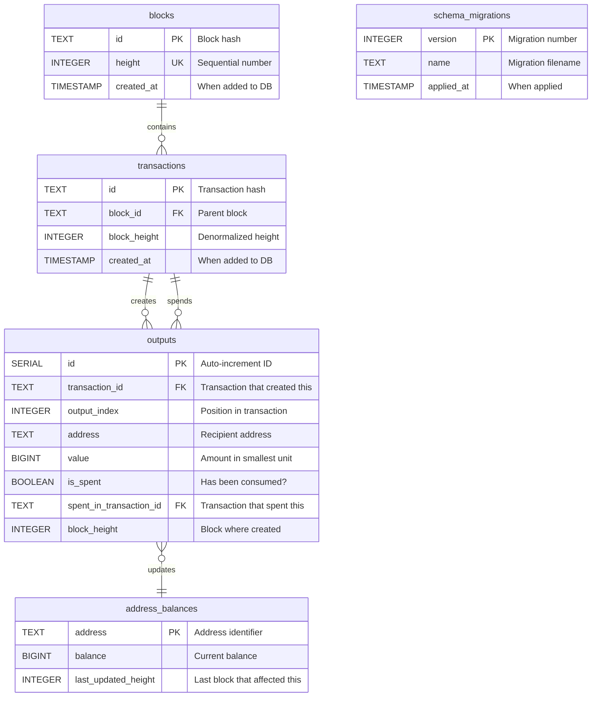
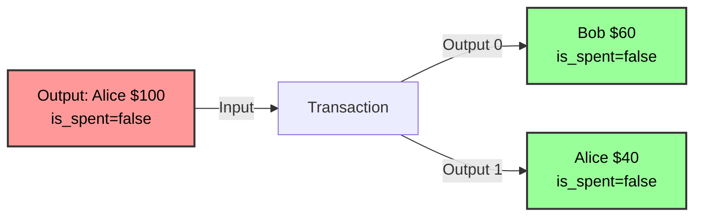

# Database Entity Relationship Diagram (ERD)

## Visual Schema



## Detailed Schema Relationships

### 1. **blocks → transactions** (One-to-Many)

- **Relationship**: One block contains multiple transactions
- **Foreign Key**: `transactions.block_id` → `blocks.id`
- **Cascade**: DELETE CASCADE (deleting block removes its transactions)
- **Business Rule**: Every transaction must belong to exactly one block

### 2. **transactions → outputs** (One-to-Many, Creator)

- **Relationship**: One transaction creates multiple outputs
- **Foreign Key**: `outputs.transaction_id` → `transactions.id`
- **Cascade**: DELETE CASCADE (deleting transaction removes its outputs)
- **Business Rule**: Every output is created by exactly one transaction

### 3. **transactions → outputs** (One-to-Many, Spender)

- **Relationship**: One transaction can spend multiple outputs
- **Foreign Key**: `outputs.spent_in_transaction_id` → `transactions.id`
- **Cascade**: DELETE SET NULL (deleting transaction unspends the output)
- **Business Rule**: An output can be spent by at most one transaction

### 4. **outputs → address_balances** (Many-to-One, Derived)

- **Relationship**: Multiple outputs per address derive a single balance
- **Materialized View**: `address_balances` is a cached/denormalized table
- **Update Trigger**: Manual updates via application logic
- **Business Rule**: Balance = SUM(value) WHERE address = X AND is_spent = false

## UTXO Model Explanation

### Core Concept

The UTXO (Unspent Transaction Output) model tracks individual "coins" rather than account balances:

```
Traditional Account Model:
- Alice: $100
- Bob: $50

UTXO Model:
- Output #1: Alice owns $60 (from tx1)
- Output #2: Alice owns $40 (from tx2)
- Output #3: Bob owns $50 (from tx3)
```

### How Spending Works



**What Happens:**

1. Alice's $100 output gets marked as `is_spent=true`
2. Bob receives a new $60 output (`is_spent=false`)
3. Alice receives a new $40 output (change, `is_spent=false`)

### Database State Changes

**Before Transaction:**

```sql
-- outputs table
id | tx_id | index | address | value | is_spent | spent_tx_id
1  | tx1   | 0     | Alice   | 100   | false    | NULL

-- address_balances table
address | balance
Alice   | 100
Bob     | 0
```

**After Transaction:**

```sql
-- outputs table
id | tx_id | index | address | value | is_spent | spent_tx_id
1  | tx1   | 0     | Alice   | 100   | true     | tx2        <-- marked spent
2  | tx2   | 0     | Bob     | 60    | false    | NULL       <-- new output
3  | tx2   | 1     | Alice   | 40    | false    | NULL       <-- new output (change)

-- address_balances table
address | balance | last_updated_height
Alice   | 40      | 2                    <-- decreased by 60
Bob     | 60      | 2                    <-- increased by 60
```

## Indexes and Performance

### Primary Indexes

```sql
-- Fast lookups by ID
blocks.id (PRIMARY KEY)
transactions.id (PRIMARY KEY)
outputs.id (PRIMARY KEY)
address_balances.address (PRIMARY KEY)

-- Ensure uniqueness
blocks.height (UNIQUE)
outputs.(transaction_id, output_index) (UNIQUE)
```

### Secondary Indexes

```sql
-- Fast block height queries
CREATE INDEX idx_blocks_height ON blocks(height);

-- Fast address balance lookups
CREATE INDEX idx_outputs_address ON outputs(address);

-- Fast UTXO validation (find unspent outputs)
CREATE INDEX idx_outputs_spent ON outputs(is_spent);
```

### Query Performance Examples

**1. Get Address Balance (O(1) with index)**

```sql
SELECT balance FROM address_balances WHERE address = 'addr1';
-- Uses: address_balances.address (PRIMARY KEY)
-- Performance: Constant time lookup
```

**2. Validate UTXO Exists and Unspent (O(1) with composite index)**

```sql
SELECT value, is_spent
FROM outputs
WHERE transaction_id = 'tx1' AND output_index = 0;
-- Uses: outputs.(transaction_id, output_index) (UNIQUE)
-- Performance: Constant time lookup
```

**3. Get Current Blockchain Height (O(1) with index)**

```sql
SELECT MAX(height) FROM blocks;
-- Uses: idx_blocks_height
-- Performance: Index scan, very fast
```

## Data Integrity Rules

### Foreign Key Constraints

```sql
-- Transaction must belong to valid block
transactions.block_id → blocks.id (ON DELETE CASCADE)

-- Output must be created by valid transaction
outputs.transaction_id → transactions.id (ON DELETE CASCADE)

-- If output is spent, must reference valid transaction
outputs.spent_in_transaction_id → transactions.id (ON DELETE SET NULL)
```

### Application-Level Constraints

1. **UTXO Validation**: Can't spend the same output twice
2. **Balance Equation**: Input sum must equal output sum (except coinbase)
3. **Sequential Heights**: Blocks must be sequential (no gaps)
4. **Hash Validation**: Block ID must match computed hash

## Denormalization Strategy

### Why `block_height` in transactions and outputs?

**Denormalized Field**: `transactions.block_height` and `outputs.block_height`

**Reason**: Avoid expensive JOINs

```sql
-- WITHOUT denormalization (requires JOIN)
SELECT * FROM outputs
JOIN transactions ON outputs.transaction_id = transactions.id
JOIN blocks ON transactions.block_id = blocks.id
WHERE blocks.height > 100;

-- WITH denormalization (direct query)
SELECT * FROM outputs WHERE block_height > 100;
```

**Trade-off**: Storage space for query performance

### Why `address_balances` table?

**Materialized View**: Cache of computed balances

**Reason**: Balance calculation is expensive

```sql
-- WITHOUT cache (expensive every time)
SELECT address, SUM(value) as balance
FROM outputs
WHERE is_spent = false
GROUP BY address;

-- WITH cache (O(1) lookup)
SELECT balance FROM address_balances WHERE address = 'addr1';
```

**Update Strategy**: Real-time updates during transaction processing

## Schema Evolution (Migrations)

The `schema_migrations` table tracks database version:

```sql
schema_migrations {
    version        -- Migration number (1, 2, 3, ...)
    name           -- Migration filename
    applied_at     -- Timestamp of application
}
```

**Example:**

```sql
SELECT * FROM schema_migrations ORDER BY version;

version | name                  | applied_at
--------|-----------------------|-------------------------
1       | 001_initial_schema    | 2025-10-03 10:00:00
2       | 002_adding_seed_data  | 2025-10-03 10:05:00
```

This ensures:

- Reproducible deployments
- Version control for schema changes
- Safe rollbacks
- Team coordination

## Storage Estimates

### Example: 1000 Blocks with 3 Transactions Each

```
blocks:         1,000 rows × ~100 bytes  = 100 KB
transactions:   3,000 rows × ~150 bytes  = 450 KB
outputs:        9,000 rows × ~200 bytes  = 1.8 MB
address_balances: 500 rows × ~100 bytes  = 50 KB

Total: ~2.4 MB for 1,000 blocks
```

**Scaling**: ~2.4 GB per million blocks (before compression)

## Security Considerations

### 1. **UTXO Double-Spend Prevention**

```sql
-- Check if output already spent before using as input
SELECT is_spent FROM outputs
WHERE transaction_id = ? AND output_index = ?;
-- If is_spent = true, reject transaction
```

### 2. **Transaction Atomicity**

```typescript
// All or nothing - uses database transactions
await client.query('BEGIN');
// ... multiple operations ...
await client.query('COMMIT');
```

### 3. **Cascade Deletions**

- Deleting a block automatically removes all dependent data
- Prevents orphaned records
- Maintains referential integrity
