# Test Cases with Example Data

Comprehensive test case diagrams covering all scenarios with real example data.

## Table of Contents

1. [Happy Path Test Suite](#happy-path-test-suite)
2. [Error Handling Test Suite](#error-handling-test-suite)
3. [Edge Cases Test Suite](#edge-cases-test-suite)
4. [Performance Test Suite](#performance-test-suite)
5. [Rollback Test Suite](#rollback-test-suite)

---

## Happy Path Test Suite

### Test Case 1: Genesis Block Creation

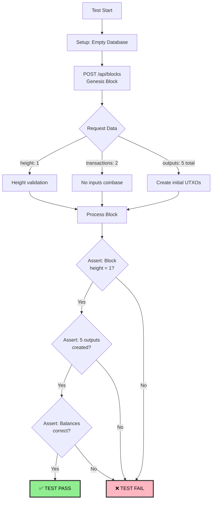

**Test Data:**

```json
{
  "id": "f9c5c8e1e9c9e3f5c5f9c5c8e1e9c9e3f5c5f9c5c8e1e9c9e3f5c5f9c5c8e1e9",
  "height": 1,
  "transactions": [
    {
      "id": "tx1",
      "inputs": [],
      "outputs": [
        { "address": "addr1", "value": 1000 },
        { "address": "addr2", "value": 500 },
        { "address": "addr3", "value": 250 }
      ]
    },
    {
      "id": "tx2",
      "inputs": [],
      "outputs": [
        { "address": "addr4", "value": 800 },
        { "address": "addr5", "value": 300 }
      ]
    }
  ]
}
```

**Expected Database State:**

```sql
-- blocks
SELECT * FROM blocks WHERE height = 1;
-- Result: 1 row

-- outputs
SELECT COUNT(*) FROM outputs WHERE block_height = 1;
-- Result: 5

-- address_balances
SELECT address, balance FROM address_balances ORDER BY address;
-- Results:
-- addr1: 1000
-- addr2: 500
-- addr3: 250
-- addr4: 800
-- addr5: 300
```

**Assertions:**

- ✅ Block inserted with height 1
- ✅ 2 transactions created
- ✅ 5 outputs created, all `is_spent = false`
- ✅ 5 address balances match expected values
- ✅ Response status: 201 Created

---

### Test Case 2: Regular Transaction with Inputs

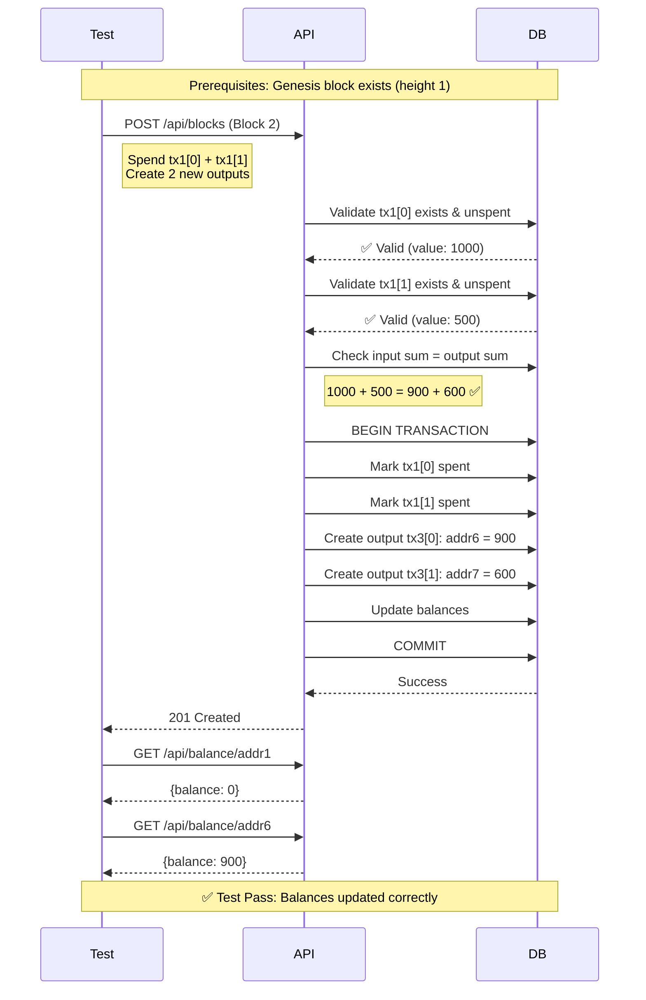

**Test Data:**

```json
{
  "id": "a1b2c3d4e5f6a7b8c9d0e1f2a3b4c5d6e7f8a9b0c1d2e3f4a5b6c7d8e9f0a1b2",
  "height": 2,
  "transactions": [
    {
      "id": "tx3",
      "inputs": [
        { "txId": "tx1", "index": 0 },
        { "txId": "tx1", "index": 1 }
      ],
      "outputs": [
        { "address": "addr6", "value": 900 },
        { "address": "addr7", "value": 600 }
      ]
    }
  ]
}
```

**Before/After State:**

```
BEFORE:
  addr1: 1000 (tx1[0])
  addr2: 500  (tx1[1])
  addr6: 0
  addr7: 0

AFTER:
  addr1: 0    (spent)
  addr2: 0    (spent)
  addr6: 900  (new)
  addr7: 600  (new)

  tx1[0]: is_spent = true, spent_in_transaction_id = 'tx3'
  tx1[1]: is_spent = true, spent_in_transaction_id = 'tx3'
```

**Assertions:**

- ✅ Previous outputs marked as spent
- ✅ New outputs created with correct values
- ✅ Balances updated correctly
- ✅ Total value conserved: 1500 in = 1500 out

---

### Test Case 3: Get Balance

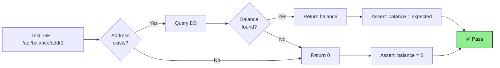

**Test Scenarios:**

| Address | Expected Balance | Test                                      |
| ------- | ---------------- | ----------------------------------------- |
| addr1   | 1000             | ✅ Existing address with balance          |
| addr999 | 0                | ✅ Non-existent address returns 0         |
| ""      | Error            | ✅ Empty address returns validation error |

**Test Code Example:**

```javascript
// Test 1: Existing address
const response1 = await app.inject({
  method: 'GET',
  url: '/api/balance/addr1'
});
assert.equal(response1.statusCode, 200);
assert.equal(response1.json().balance, 1000);

// Test 2: Non-existent address
const response2 = await app.inject({
  method: 'GET',
  url: '/api/balance/addr999'
});
assert.equal(response2.statusCode, 200);
assert.equal(response2.json().balance, 0);
```

---

## Error Handling Test Suite

### Test Case 4: Invalid Block Height

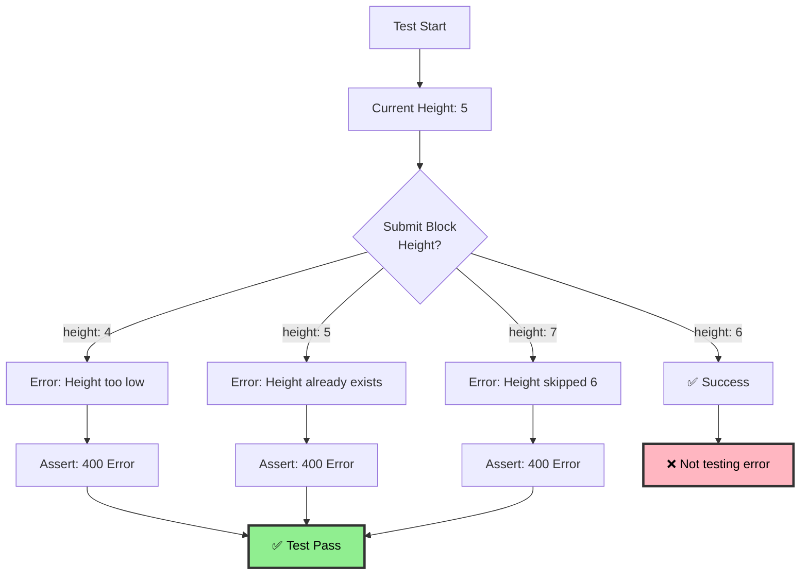

**Test Cases:**

```javascript
// Current height: 5

// Test 1: Height too low
await expect(
  processBlock({ height: 4, ... })
).rejects.toThrow('Block height must be 6');

// Test 2: Height already exists
await expect(
  processBlock({ height: 5, ... })
).rejects.toThrow('Block height must be 6');

// Test 3: Height skips ahead
await expect(
  processBlock({ height: 7, ... })
).rejects.toThrow('Block height must be 6');
```

**Expected Errors:**

```json
{
  "error": "INVALID_BLOCK_HEIGHT",
  "message": "Block height must be 6, but received 4",
  "currentHeight": 5
}
```

---

### Test Case 5: Invalid UTXO Reference

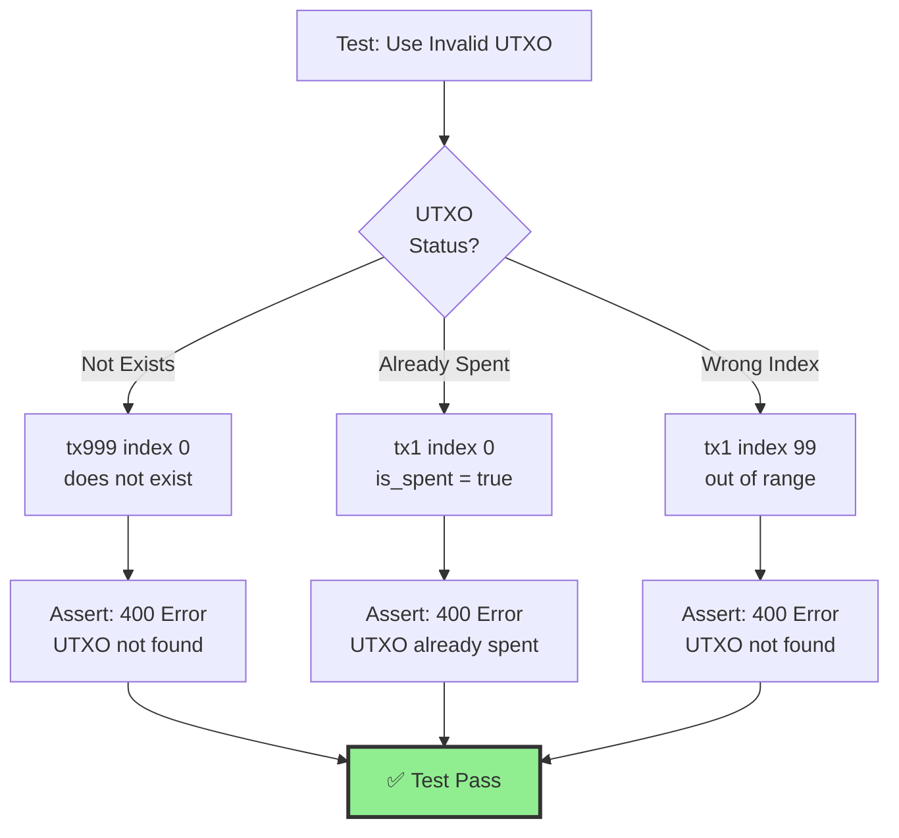

**Test Data Examples:**

```javascript
// Test 1: Non-existent transaction
{
  "inputs": [{ "txId": "tx999", "index": 0 }],
  "outputs": [{ "address": "addr1", "value": 100 }]
}
// Expected: 400 "UTXO tx999[0] not found"

// Test 2: Already spent UTXO
// (After tx1[0] was spent in previous block)
{
  "inputs": [{ "txId": "tx1", "index": 0 }],
  "outputs": [{ "address": "addr1", "value": 100 }]
}
// Expected: 400 "UTXO tx1[0] already spent"

// Test 3: Invalid index
{
  "inputs": [{ "txId": "tx1", "index": 99 }],
  "outputs": [{ "address": "addr1", "value": 100 }]
}
// Expected: 400 "UTXO tx1[99] not found"
```

---

### Test Case 6: Input/Output Mismatch

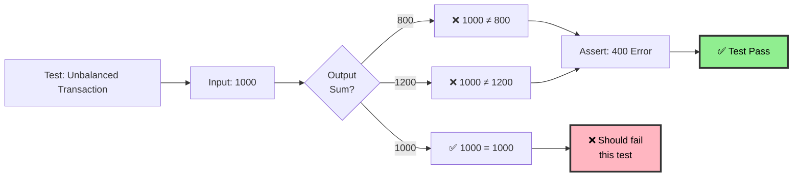

**Test Cases:**

```javascript
// Input value: 1000

// Test 1: Outputs less than inputs
{
  "inputs": [{ "txId": "tx1", "index": 0 }],  // 1000
  "outputs": [
    { "address": "addr6", "value": 800 }       // 800 total
  ]
}
// Expected: 400 "Input sum (1000) ≠ Output sum (800)"

// Test 2: Outputs more than inputs
{
  "inputs": [{ "txId": "tx1", "index": 0 }],  // 1000
  "outputs": [
    { "address": "addr6", "value": 700 },
    { "address": "addr7", "value": 500 }       // 1200 total
  ]
}
// Expected: 400 "Input sum (1000) ≠ Output sum (1200)"

// Test 3: Exact match (should succeed)
{
  "inputs": [{ "txId": "tx1", "index": 0 }],  // 1000
  "outputs": [
    { "address": "addr6", "value": 600 },
    { "address": "addr7", "value": 400 }       // 1000 total ✅
  ]
}
```

---

### Test Case 7: Invalid Block Hash

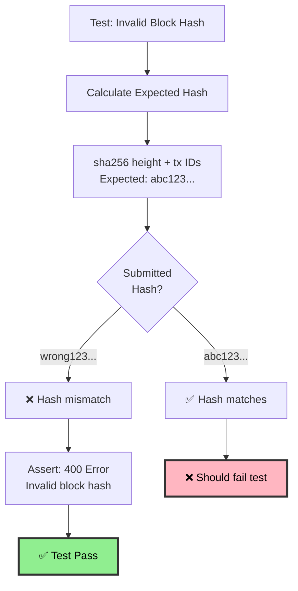

**Test Example:**

```javascript
const block = {
  id: "wronghash123",  // ❌ Incorrect hash
  height: 2,
  transactions: [{ id: "tx3", ... }]
};

// Expected hash: sha256("2" + "tx3") = "5f4dcc3b5aa765d..."

await expect(processBlock(block))
  .rejects.toThrow('Invalid block hash');
```

---

## Edge Cases Test Suite

### Test Case 8: Coinbase Transaction (No Inputs)

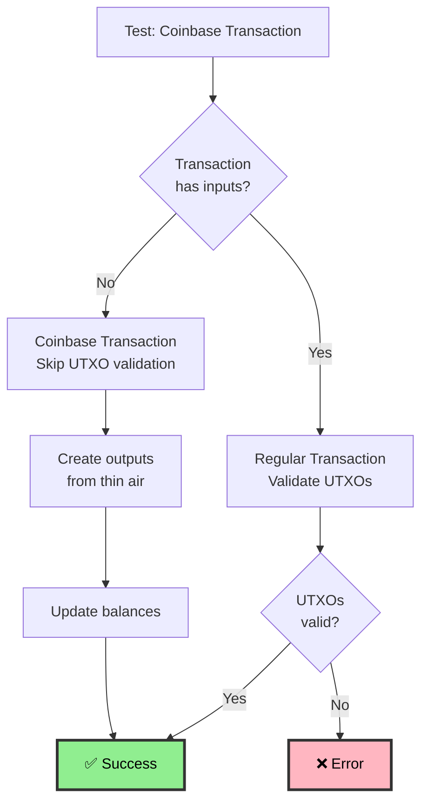

**Test Data:**

```json
{
  "id": "tx_coinbase",
  "inputs": [],
  "outputs": [{ "address": "addr_miner", "value": 100 }]
}
```

**Assertions:**

- ✅ No input validation performed
- ✅ Output created with value 100
- ✅ addr_miner balance increased by 100
- ✅ No "input sum != output sum" error

---

### Test Case 9: Large Transaction (Multiple Inputs/Outputs)

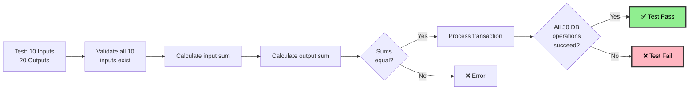

**Test Data:**

```json
{
  "id": "tx_large",
  "inputs": [
    { "txId": "tx1", "index": 0 },
    { "txId": "tx2", "index": 0 }
    // ... 8 more inputs
  ],
  "outputs": [
    { "address": "addr1", "value": 50 },
    { "address": "addr2", "value": 75 }
    // ... 18 more outputs
  ]
}
```

**Performance Assertions:**

- ✅ All 10 inputs validated
- ✅ All 20 outputs created
- ✅ 10 addresses debited
- ✅ 20 addresses credited
- ✅ Transaction completes in < 1 second

---

### Test Case 10: Zero Value Output

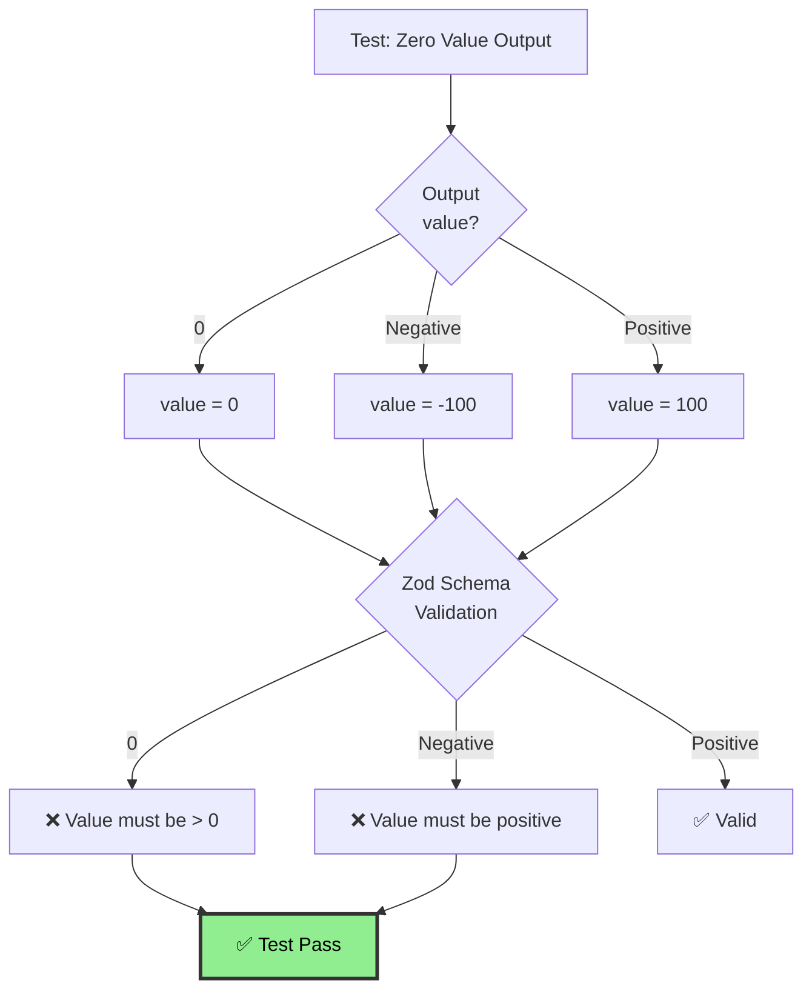

**Test Cases:**

```javascript
// Test 1: Zero value
{
  "outputs": [{ "address": "addr1", "value": 0 }]
}
// Expected: 400 "Output value must be greater than 0"

// Test 2: Negative value
{
  "outputs": [{ "address": "addr1", "value": -100 }]
}
// Expected: 400 "Output value must be positive"

// Test 3: Valid positive value
{
  "outputs": [{ "address": "addr1", "value": 100 }]
}
// Expected: ✅ Success
```

---

## Performance Test Suite

### Test Case 11: Concurrent Block Submissions

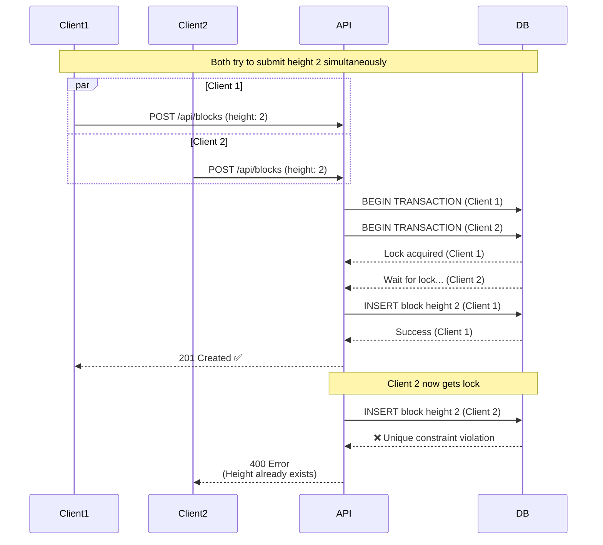

**Test Assertions:**

- ✅ Only one block at height 2 exists
- ✅ First client succeeds (201)
- ✅ Second client fails (400)
- ✅ Database maintains consistency

---

### Test Case 12: High-Volume Balance Queries

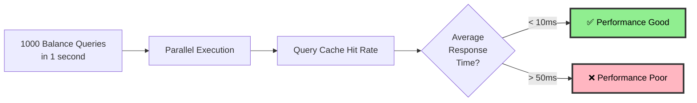

**Test Code:**

```javascript
const start = Date.now();
const promises = [];

for (let i = 0; i < 1000; i++) {
  promises.push(
    app.inject({
      method: 'GET',
      url: `/api/balance/addr${i % 100}`
    })
  );
}

await Promise.all(promises);
const duration = Date.now() - start;

assert(duration < 10000, 'Should complete in < 10 seconds');
assert(avgResponseTime < 10, 'Average response < 10ms');
```

**Assertions:**

- ✅ All 1000 queries succeed
- ✅ Total time < 10 seconds
- ✅ Average response time < 10ms
- ✅ No database connection errors

---

## Rollback Test Suite

### Test Case 13: Simple Rollback

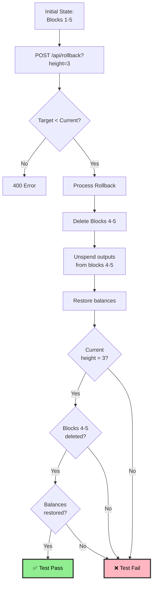

**Before Rollback:**

```
Blocks: 1, 2, 3, 4, 5
Current Height: 5
addr30 balance: 426 (created in block 6, doesn't exist yet in this test)
```

**After Rollback to Height 3:**

```
Blocks: 1, 2, 3
Current Height: 3
addr30 balance: 0 (outputs deleted)
addr13 balance: 440 (restored, was spent in block 4)
```

**Assertions:**

- ✅ Blocks 4 and 5 deleted
- ✅ Outputs from blocks 4-5 deleted
- ✅ Outputs spent in blocks 4-5 marked unspent
- ✅ Balances recalculated correctly

---

### Test Case 14: Rollback Depth Limit

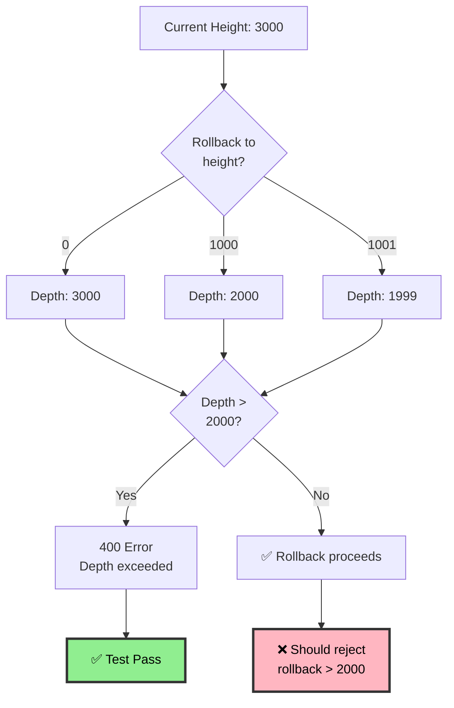

**Test Cases:**

```javascript
// Current height: 3000

// Test 1: Rollback 3000 blocks (exceeds limit)
await expect(rollback({ height: 0 })).rejects.toThrow('Cannot rollback more than 2000 blocks');

// Test 2: Rollback exactly 2000 blocks (at limit)
const result = await rollback({ height: 1000 });
assert.equal(result.newHeight, 1000); // ✅ Success

// Test 3: Rollback 1999 blocks (under limit)
const result2 = await rollback({ height: 1001 });
assert.equal(result2.newHeight, 1001); // ✅ Success
```

---

## Test Suite Summary

### Coverage Matrix

| Category           | Test Cases | Status |
| ------------------ | ---------- | ------ |
| **Happy Path**     | 3          | ✅     |
| **Error Handling** | 4          | ✅     |
| **Edge Cases**     | 3          | ✅     |
| **Performance**    | 2          | ✅     |
| **Rollback**       | 2          | ✅     |
| **Total**          | **14**     | **✅** |

### Test Execution Flow

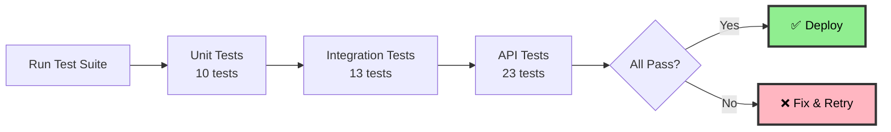

### Command to Run Tests

```bash
# All tests (36 total)
npm test

# Unit tests only (10 tests, fast)
npm run test:unit

# Database integration tests (13 tests)
npm run test:db

# API integration tests (23 tests)
npm run test:api
```
