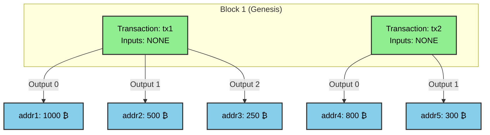
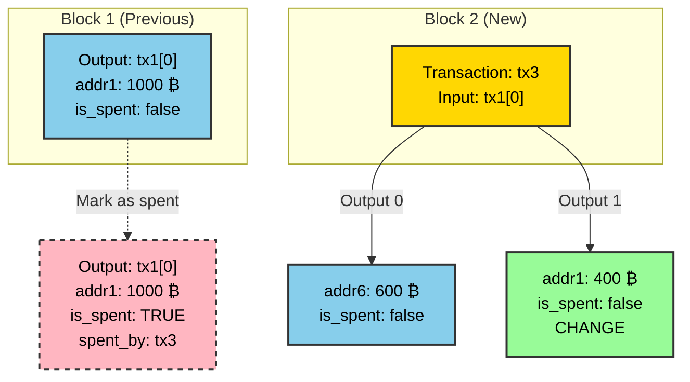
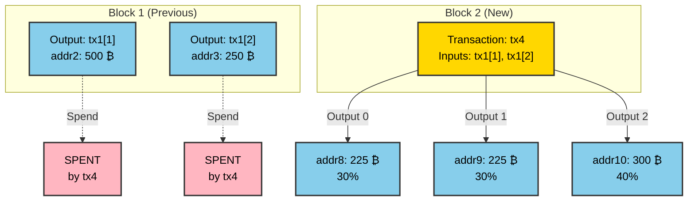
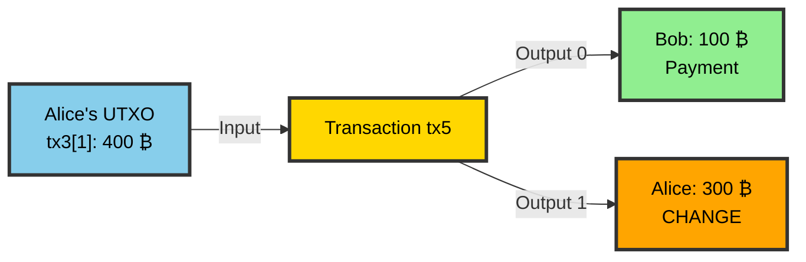
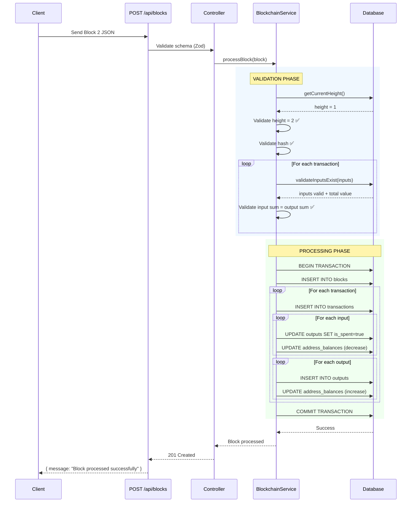
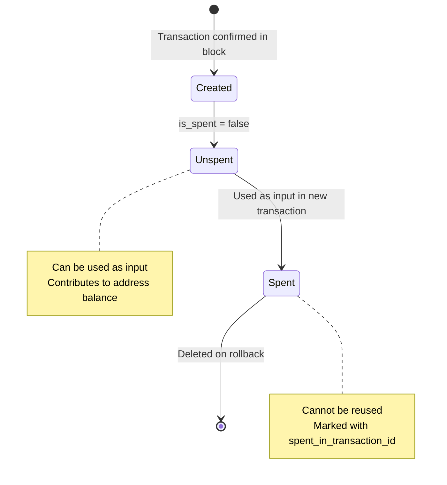

# UTXO Flow Diagrams with Examples

## Table of Contents

1. [Genesis Block (Coinbase Only)](#genesis-block)
2. [Regular Transaction (Spending UTXOs)](#regular-transaction)
3. [Multiple Inputs/Outputs](#multiple-inputsoutputs)
4. [Change Transaction](#change-transaction)
5. [Complete Block Processing](#complete-block-processing)

---

## Genesis Block (Coinbase Only)

### Scenario

Block 1 creates initial coins with no inputs (coinbase transactions).

### Visual Flow



### Request Payload

```json
POST /api/blocks
{
  "id": "block1hash",
  "height": 1,
  "transactions": [
    {
      "id": "tx1",
      "inputs": [],
      "outputs": [
        { "address": "addr1", "value": 1000 },
        { "address": "addr2", "value": 500 },
        { "address": "addr3", "value": 250 }
      ]
    },
    {
      "id": "tx2",
      "inputs": [],
      "outputs": [
        { "address": "addr4", "value": 800 },
        { "address": "addr5", "value": 300 }
      ]
    }
  ]
}
```

### Database State After Processing

**outputs table:**

```
id | tx_id | index | address | value | is_spent | spent_tx_id | block_height
---+-------+-------+---------+-------+----------+-------------+-------------
1  | tx1   | 0     | addr1   | 1000  | false    | NULL        | 1
2  | tx1   | 1     | addr2   | 500   | false    | NULL        | 1
3  | tx1   | 2     | addr3   | 250   | false    | NULL        | 1
4  | tx2   | 0     | addr4   | 800   | false    | NULL        | 1
5  | tx2   | 1     | addr5   | 300   | false    | NULL        | 1
```

**address_balances table:**

```
address | balance | last_updated_height
--------+---------+--------------------
addr1   | 1000    | 1
addr2   | 500     | 1
addr3   | 250     | 1
addr4   | 800     | 1
addr5   | 300     | 1
```

**Validation Rules:**

- ✅ Coinbase transactions have no inputs
- ✅ No UTXO validation needed
- ✅ Creates new value from nothing
- ✅ Block height must be 1 (current height + 1)

---

## Regular Transaction (Spending UTXOs)

### Scenario

Alice (addr1) sends 600 ₿ to Bob (addr6), using her 1000 ₿ output from Block 1.

### Visual Flow



### Request Payload

```json
POST /api/blocks
{
  "id": "block2hash",
  "height": 2,
  "transactions": [
    {
      "id": "tx3",
      "inputs": [
        { "txId": "tx1", "index": 0 }
      ],
      "outputs": [
        { "address": "addr6", "value": 600 },
        { "address": "addr1", "value": 400 }
      ]
    }
  ]
}
```

### Database State Changes

**BEFORE Transaction (Block 1 state):**

```sql
-- outputs table
id | tx_id | index | address | value | is_spent | spent_tx_id
1  | tx1   | 0     | addr1   | 1000  | false    | NULL

-- address_balances table
address | balance
addr1   | 1000
addr6   | 0
```

**AFTER Transaction (Block 2 state):**

```sql
-- outputs table
id | tx_id | index | address | value | is_spent | spent_tx_id
1  | tx1   | 0     | addr1   | 1000  | true     | tx3         <-- MARKED SPENT
6  | tx3   | 0     | addr6   | 600   | false    | NULL        <-- NEW OUTPUT
7  | tx3   | 1     | addr1   | 400   | false    | NULL        <-- CHANGE

-- address_balances table
address | balance | last_updated_height
addr1   | 400     | 2                    <-- 1000 - 1000 + 400 = 400
addr6   | 600     | 2                    <-- 0 + 600 = 600
```

### Validation Steps

1. ✅ **Input Validation**: tx1[0] exists and `is_spent = false`
2. ✅ **Value Validation**: Input (1000) = Output (600 + 400)
3. ✅ **Height Validation**: Current height (1) + 1 = 2
4. ✅ **Hash Validation**: Block ID matches sha256(height + tx3.id)

---

## Multiple Inputs/Outputs

### Scenario

Charlie combines two small UTXOs to create multiple outputs.

### Visual Flow



### Request Payload

```json
POST /api/blocks
{
  "id": "block2hash",
  "height": 2,
  "transactions": [
    {
      "id": "tx4",
      "inputs": [
        { "txId": "tx1", "index": 1 },
        { "txId": "tx1", "index": 2 }
      ],
      "outputs": [
        { "address": "addr8", "value": 225 },
        { "address": "addr9", "value": 225 },
        { "address": "addr10", "value": 300 }
      ]
    }
  ]
}
```

### Balance Calculations

```
Input Sum:  500 + 250 = 750
Output Sum: 225 + 225 + 300 = 750 ✅ VALID

addr2: 500 - 500 = 0    (spent entire output)
addr3: 250 - 250 = 0    (spent entire output)
addr8: 0 + 225 = 225    (new recipient)
addr9: 0 + 225 = 225    (new recipient)
addr10: 0 + 300 = 300   (new recipient)
```

---

## Change Transaction

### Scenario

Alice pays 100 ₿ to Bob but her smallest UTXO is 400 ₿, so she gets 300 ₿ back as change.

### Visual Flow



### Request Payload

```json
POST /api/blocks
{
  "id": "block3hash",
  "height": 3,
  "transactions": [
    {
      "id": "tx5",
      "inputs": [
        { "txId": "tx3", "index": 1 }
      ],
      "outputs": [
        { "address": "addr_bob", "value": 100 },
        { "address": "addr1", "value": 300 }
      ]
    }
  ]
}
```

### Key Insight

- **Change Output**: addr1 receives back the difference
- **Common Pattern**: Most real-world transactions include change
- **Privacy Note**: Change goes to same or new address

---

## Complete Block Processing Flow

### End-to-End Process for Block 2



### Example: Block 2 with Multiple Transactions

**Request:**

```json
POST /api/blocks
{
  "id": "a1b2c3d4e5f6...",
  "height": 2,
  "transactions": [
    {
      "id": "tx3",
      "inputs": [{ "txId": "tx1", "index": 0 }, { "txId": "tx1", "index": 1 }],
      "outputs": [
        { "address": "addr6", "value": 900 },
        { "address": "addr7", "value": 600 }
      ]
    },
    {
      "id": "tx4",
      "inputs": [{ "txId": "tx1", "index": 2 }],
      "outputs": [
        { "address": "addr8", "value": 75 },
        { "address": "addr9", "value": 75 },
        { "address": "addr10", "value": 100 }
      ]
    },
    {
      "id": "tx5",
      "inputs": [],
      "outputs": [{ "address": "addr11", "value": 100 }]
    }
  ]
}
```

### Processing Steps

#### Step 1: Validate Block

```
✅ Height check: current (1) + 1 = expected (2)
✅ Hash check: sha256(2 + "tx3" + "tx4" + "tx5") = block.id
```

#### Step 2: Validate tx3

```
Input Validation:
  - tx1[0] exists? YES, value=1000, is_spent=false ✅
  - tx1[1] exists? YES, value=500, is_spent=false ✅
  - Total input value: 1500

Output Validation:
  - Total output value: 900 + 600 = 1500 ✅
```

#### Step 3: Process tx3

```sql
-- Mark inputs as spent
UPDATE outputs SET is_spent=true, spent_in_transaction_id='tx3'
WHERE transaction_id='tx1' AND output_index IN (0, 1);

-- Decrease balances
UPDATE address_balances SET balance = balance - 1000 WHERE address='addr1';
UPDATE address_balances SET balance = balance - 500 WHERE address='addr2';

-- Create new outputs
INSERT INTO outputs (transaction_id, output_index, address, value, is_spent, block_height)
VALUES ('tx3', 0, 'addr6', 900, false, 2),
       ('tx3', 1, 'addr7', 600, false, 2);

-- Increase balances
INSERT INTO address_balances (address, balance, last_updated_height)
VALUES ('addr6', 900, 2), ('addr7', 600, 2)
ON CONFLICT (address) DO UPDATE SET balance = address_balances.balance + EXCLUDED.balance;
```

#### Step 4: Validate tx4

```
Input: tx1[2] = 250 ✅
Output: 75 + 75 + 100 = 250 ✅
```

#### Step 5: Validate tx5 (Coinbase)

```
Inputs: [] (empty) ✅ Coinbase allowed
Outputs: 100 ✅
```

### Final State

**Blocks:**

```
height | id
-------+----------------
1      | block1hash
2      | a1b2c3d4e5f6...
```

**Outputs (Unspent only):**

```
tx_id | index | address | value | is_spent
------+-------+---------+-------+---------
tx2   | 0     | addr4   | 800   | false
tx2   | 1     | addr5   | 300   | false
tx3   | 0     | addr6   | 900   | false
tx3   | 1     | addr7   | 600   | false
tx4   | 0     | addr8   | 75    | false
tx4   | 1     | addr9   | 75    | false
tx4   | 2     | addr10  | 100   | false
tx5   | 0     | addr11  | 100   | false
```

**Balances:**

```
address | balance
--------+--------
addr1   | 0       (1000 spent)
addr2   | 0       (500 spent)
addr3   | 0       (250 spent)
addr4   | 800
addr5   | 300
addr6   | 900
addr7   | 600
addr8   | 75
addr9   | 75
addr10  | 100
addr11  | 100
```

---

## UTXO State Machine



### Output Lifecycle Example

```
1. Created:  Block 1, tx1 creates output[0] for addr1 (1000 ₿)
             → is_spent = false

2. Unspent:  Output available for spending
             → addr1 balance includes this 1000 ₿

3. Spent:    Block 2, tx3 uses tx1[0] as input
             → is_spent = true
             → spent_in_transaction_id = 'tx3'
             → addr1 balance excludes this output

4. Deleted:  If Block 2 is rolled back
             → Output reverts to unspent
             → spent_in_transaction_id = NULL
             → is_spent = false
```
